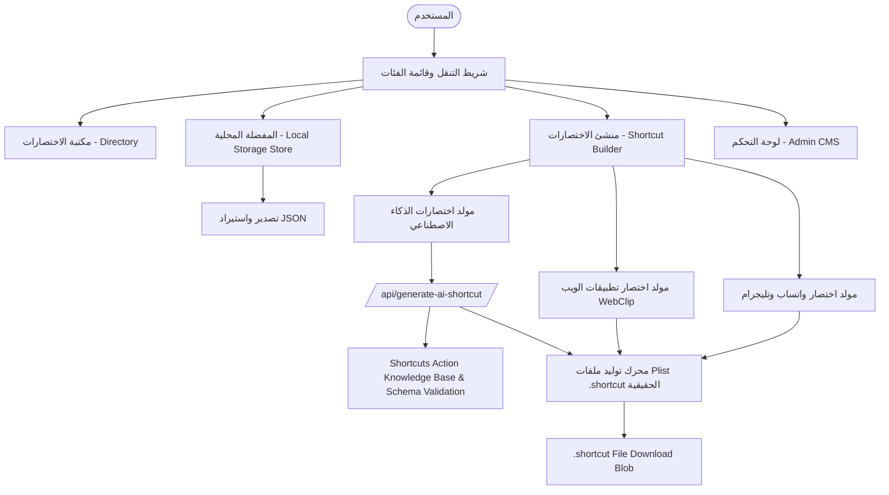

# وثيقة خطة مشروع منصة اختصارات الآيفون (iOS Shortcuts Hub & Builder)

---

## 1. نبذة عن المشروع (Overview)
منصة ويب عصرية وتفاعلية تهدف إلى جمع، تنظيم، وتوفير أشهر وأقوى اختصارات نظام iOS باللغة العربية مع إمكانية تثبيتها على أجهزة المستخدمين بنقرة واحدة، بالإضافة إلى أداة مبتكرة تسمح للمستخدمين بتوليد وإنشاء اختصارات مخصصة مباشرة من المتصفح وتنزيلها بصيغة `.shortcut`. يدعم الموقع تصفحاً حراً وسريعاً بدون إجبار الزائر على إنشاء حساب، مع توفير ميزة حفظ المفضلة محلياً على جهاز المستخدم (Client-Side Local Storage).

---

## 2. الميزات والوظائف الأساسية (Core Features)

### أ. دليل ومكتبة الاختصارات (Shortcuts Directory)
* **التثبيت بنقرة واحدة (One-Click Install):** ربط بطاقات الاختصارات بروابط iCloud المباشرة وبروتوكول `shortcuts://`.
* **الفئات والتصنيفات (Categorization):**
  * الذكاء الاصطناعي (AI & Automation).
  * الإنتاجية والعمل (Productivity & Workflows).
  * أدوات الوسائط والصور (Media, Downloaders, Video Tools).
  * أدوات المطورين والمصممين (Dev & Design Utilities).
  * النظام والبطارية (System & Battery Optimizations).
* **محرك البحث والفلترة:** بحث فوري بالاسم أو الكلمات المفتاحية مع تصنيف حسب إصدار iOS والشعبية.
* **مؤشر التوافق والتحديث:** توضيح حالة عمل الاختصار وتوافقه مع إصدارات iOS الحالية.

### ب. نظام المفضلة المحلية (Local Bookmarks & Favorites)
* **حفظ فوري بدون تسجيل (No Auth Required):** إمكانية الضغط على زر القلب/المفضلة على أي اختصار وحفظه فوراً على متصفح جهاز المستخدم باستخدام `LocalStorage` أو `IndexedDB`.
* **تبويب مخصص للمفضلة (Saved / Favorites Tab):** قسم مخصص وسريع في الموقع يتيح للمستخدم استعراض جميع الاختصارات التي حفظها على هاتفه للرجوع إليها في أي وقت.
* **استيراد وتصدير المفضلة (Backup & Restore):** إمكانية تصدير قائمة الاختصارات المحفوظة كملف JSON ومشاركتها أو استعادتها على جهاز آخر بنقرة واحدة.

### ج. منشئ الاختصارات السريع أونلاين (Online Shortcut Builder)
* **مولد اختصار الذكاء الاصطناعي (AI Prompt Assistant):**
  * يعتمد المولّد على **مفتاح API خاص بالمنصة نفسها** (وليس مفتاح المستخدم)، بحيث يقوم المستخدم فقط بإدخال الـ Prompt المخصص، وتتولى المنصة الاتصال بالـ API من طرف الخادم (Backend) وتوليد اختصار جاهز للعمل من قائمة المشاركة.
  * هذا يعني الحاجة لطبقة Backend/Serverless Function لاستدعاء الـ API بشكل آمن، بدلاً من الاعتماد الكامل على المعالجة من جانب العميل (Client-Side) كباقي أدوات المولّد.
  * **متطلب أساسي: نموذج مدرّب/مخصص على بنية اختصارات iOS:** لا يجوز الاعتماد على نموذج ذكاء اصطناعي عام بدون تخصيص، لأن ملفات `.shortcut` لها بنية Plist دقيقة جداً (Actions، Parameters، WFWorkflowActions) وأي خطأ بسيط بالمخرجات يخلي الملف غير قابل للفتح على الآيفون. لذلك يجب تجهيز النموذج عبر واحدة أو أكثر من الطرق التالية:
    - **Fine-tuning:** تدريب/ضبط النموذج على مجموعة بيانات من اختصارات iOS حقيقية وصحيحة (Actions وبنيتها الرسمية) ليتعلم القواعد والصيغة الصحيحة لكل فعل (Action).
    - **RAG (Retrieval-Augmented Generation):** تزويد النموذج بقاعدة معرفة (مرجع لكل Actions المتاحة وبنيتها) يستعين بها أثناء التوليد بدلاً من الاعتماد على الحفظ فقط.
    - **Prompt Engineering + Post-Validation:** تزويد الـ System Prompt بأمثلة صحيحة (Few-shot) لبنية الاختصارات، مع طبقة تحقق (Validation Layer) تتأكد أن مخرجات النموذج تطابق مخطط (Schema) الـ Plist الصحيح قبل توليد الملف النهائي، ورفض/إعادة المحاولة إذا كانت المخرجات غير صالحة.
  * **ملاحظة تقنية مهمة:** يجب وضع حدود استخدام (Rate Limiting) لكل زائر لمنع إساءة استخدام مفتاح API الخاص بالمنصة (مثل تحديد عدد الطلبات المسموحة يومياً لكل IP أو جلسة)، لتفادي استنزاف الرصيد أو التكلفة المالية.
  * **مولّد احتياطي عند غياب مفتاح API خارجي (Deterministic Fallback Generator):** في حال عدم توفر مفتاح API خارجي (`GEMINI_API_KEY` / `OPENAI_API_KEY`) في بيئة التشغيل، يعمل النظام تلقائياً بمولّد احتياطي مبني على قواعد ثابتة (Deterministic) يعتمد فقط على قاعدة المعرفة (Knowledge Base) بدلاً من استدعاء نموذج ذكاء اصطناعي خارجي، بحيث تبقى ميزة المولّد متاحة دون انقطاع للمستخدم. نظراً لاعتماده على قواعد ثابتة بدلاً من مخرجات نموذج حر، فمن المتوقع أن يكون أكثر دقة واتساقاً من مسار الذكاء الاصطناعي المباشر ضمن مجموعة الأنماط والـ Actions التي يغطيها، لكن يُفضّل تجنّب الجزم بنسبة دقة مطلقة والاكتفاء بوصفه "عالي الموثوقية ضمن الحالات المدعومة"، مع خضوعه لنفس طبقة التحقق (Validation) قبل تسليم الملف النهائي.
* **صانع اختصار المراسلة السريعة (WhatsApp / Telegram Direct):**
  * تحديد أرقام وقوالب نصوص جاهزة لإرسال الرسائل دون حفظ جهات الاتصال.
* **مولد اختصارات الويب والأدوات (Web-to-App Launcher):**
  * تحويل الروابط ومواقع الويب المفضلة إلى اختصارات مخصصة بأيقونات مميزة.
* **تصدير بصيغة `.shortcut`:** توليد ملف Plist / Shortcut جاهز للتنزيل والفتح المباشر على الآيفون.

### د. لوحة التحكم والإدارة (Admin Dashboard)
* **لوحة إدارة المحتوى (Admin CMS):** واجهة محمية للمشرف لإضافة وتعديل وحذف الاختصارات وتحديث روابطها.
* **نظام الإحصائيات:** تتبع عدد مرات التثبيت والزيارات لكل اختصار.

---

## 3. المعمارية التقنية المقترحة (Tech Stack)

| الطبقة | التقنية المقترحة | الدور والوظيفة |
| :--- | :--- | :--- |
| **الواجهة الأمامية (Frontend)** | Next.js (React) + Tailwind CSS | واجهة سريعة، متجاوبة مع الهواتف، تدعم SEO وتصميم نمط Dark Mode حديث. |
| **إدارة الحالة والمفضلة المحلية** | Zustand / LocalStorage API | تخزين معرّفات الاختصارات المفضلة محلياً في متصفح المستخدم دون الحاجة لقاعدة بيانات للمستخدمين. |
| **الرسوميات والتحريكات** | Lucide Icons + Framer Motion | أيقونات SVG مخصصة (بدون إيموجي) وتأثيرات تفاعلية وسلسة عند تصفح وفلترة البطاقات وحفظ المفضلة. |
| **نظام التصميم البصري (Design System)** | Custom Liquid Glass CSS Layer (فوق Tailwind CSS) | تطبيق تأثيرات الزجاج السائل الحقيقية: انعكاسات ضوئية، حواف متوهجة ملونة، وعمق ثلاثي الأبعاد، بدل الـ Glassmorphism المسطح التقليدي (راجع القسم 6). |
| **قاعدة البيانات (للاختصارات العامة)** | Firebase Firestore / Supabase | تخزين بيانات الاختصارات، التصنيفات، والإحصائيات وتوثيق لوحة الأدمن. |
| **توليد الاختصارات (Builder Engine)** | JavaScript Plist Generator (`bplist-creator` / XML Plist) | معالجة وتوليد ملفات `.shortcut` في جانب العميل وتنزيلها كـ Blob. |
| **طبقة الخادم لمولد الذكاء الاصطناعي (AI Backend)** | Next.js API Routes / Vercel Serverless Functions | استدعاء مفتاح API الخاص بالمنصة بشكل آمن من جهة الخادم (مع تطبيق Rate Limiting)، بحيث لا يتم كشف المفتاح أبداً في كود العميل (Client-Side). |
| **تخصيص نموذج الاختصارات (Shortcuts Knowledge Base)** | Fine-tuning Dataset / Vector DB (RAG) لبنية Actions الرسمية في iOS Shortcuts | تزويد النموذج بمعرفة دقيقة ببنية وقواعد كل Action لضمان توليد ملفات `.shortcut` صحيحة وقابلة للفتح، بدلاً من الاعتماد على نموذج عام غير مخصص. |
| **الاستضافة والنشر** | Vercel / Cloudflare Pages | استضافة سريعة عالمية مع دعم كامل للـ Edge Functions. |

---

## 4. هيكل البيانات (Data Schema - Firestore Example)

```json
{
  "id": "ai-smart-assistant",
  "title": "المساعد الذكي السريع",
  "slug": "ai-smart-assistant",
  "short_description": "اختصار لإرسال أي نص محدد للذكاء الاصطناعي وجلب الإجابة بإشعار فوري.",
  "category": "ai",
  "icon": "sparkles",
  "icloud_url": "https://www.icloud.com/shortcuts/xxxxxxxxxxxxxx",
  "version": "1.2.0",
  "ios_compatibility": "iOS 16, 17, 18+",
  "install_count": 3420,
  "featured": true,
  "author": {
    "name": "Admin",
    "link": "https://twitter.com/..."
  },
  "created_at": "2026-08-28T00:00:00Z"
}
```

---

## 5. خطة مراحل التنفيذ (Implementation Roadmap)

### المرحلة 1: التخطيط وتجهيز البنية التحتية (Setup & Architecture)
- [x] تحديد متطلبات النظام والميزات المحلية (Local Storage).
- [ ] إعداد مشروع Next.js مع Tailwind CSS وإعداد Store لإدارة المفضلة محلياً.
- [ ] تثبيت أداة الدعم التصميمي `ui-ux-pro-max` (راجع القسم 6.0) داخل بيئة التطوير للاستئناس بها أثناء بناء نظام Liquid Glass.
- [ ] تهيئة Firebase / Supabase لعرض وتخزين مكتبة الاختصارات العامة.

### المرحلة 2: واجهة المستخدم ونظام المفضلة (UI & Local Favorites)
- [ ] تصميم بطاقات الاختصارات مع زر التثبيت وزر القلب (Add to Local Favorites).
- [ ] بناء صفحة / تبويب "المفضلة" (Saved Shortcuts) لعرض ما قام المستخدم بحفظه على هاتفه.
- [ ] إضافة خيار تصدير واستيراد المفضلة كملف JSON لسهولة نقلها بين الأجهزة.

### المرحلة 3: بناء محرك إنشاء الاختصارات (Online Builder)
- [ ] بناء نماذج إدخال البيانات التفاعلية لمولدات الاختصارات (AI / WhatsApp / Web-App).
- [ ] إعداد API Route/Serverless Function خاصة تستدعي مفتاح API الخاص بالمنصة بأمان (بدون كشفه في الواجهة) لتشغيل مولّد الذكاء الاصطناعي.
- [ ] بناء/تجميع قاعدة معرفة بجميع Actions الرسمية لاختصارات iOS وبنيتها، واستخدامها لتخصيص النموذج (عبر Fine-tuning أو RAG) لضمان دقة المخرجات.
- [ ] إضافة طبقة تحقق (Validation) تتأكد من صحة بنية الاختصار الناتج عن النموذج قبل توليد ملف `.shortcut` النهائي.
- [ ] تطبيق آلية Rate Limiting على مولّد الذكاء الاصطناعي لضبط الاستخدام والتكلفة.
- [ ] كتابة دوال تحويل المدخلات إلى هيكل Plist وتوليد ملف `.shortcut`.
- [ ] اختبار توافق تنزيل الملفات وفتحها على متصفح Safari لأجهزة iOS.

### المرحلة 4: لوحة تحكم الأدمن وتغذية المحتوى (Admin & Seeding)
- [ ] بناء واجهة آمنة لإدارة المحتوى وإضافة الاختصارات المجمعة وتصنيفها.
- [ ] جمع وإضافة أفضل 30-50 اختصار شائع وعالي الجودة في مختلف الفئات.

---

## 6. الرؤية التصميمية التفصيلية (Design Intelligence - Liquid Glass System)

### 6.0 أداة الدعم التصميمي أثناء التطوير: UI/UX Pro Max Skill

يُعتمد أثناء التطوير على أداة (Skill) خارجية مفتوحة المصدر لدعم قرارات التصميم بشكل منهجي ومبني على قواعد، بدل الاعتماد على تخمين النموذج فقط:

* **المرجع:** [`nextlevelbuilder/ui-ux-pro-max-skill`](https://github.com/nextlevelbuilder/ui-ux-pro-max-skill) — أداة ذكاء تصميمي (Design Intelligence) توفر محرك بحث وتوليد أنظمة تصميم مبني على قواعد استدلال متخصصة حسب نوع المنتج (192 قاعدة صناعية)، مع مكتبات لأنماط الواجهة (79 نمطاً)، لوحات الألوان (192 لوحة)، تنسيقات الخطوط (74 توليفة)، وإرشادات UX (119 قاعدة).
* **طريقة التثبيت (Claude Code):**
  ```
  /plugin marketplace add nextlevelbuilder/ui-ux-pro-max-skill
  /plugin install ui-ux-pro-max@ui-ux-pro-max-skill
  ```
  أو عبر الـ CLI: `npm install -g ui-ux-pro-max-cli` ثم `uipro init --ai claude` داخل مجلد المشروع.
* **دور الأداة في هذا المشروع تحديداً:** تُستخدم كمرجع استشاري أثناء بناء المكونات (وليس كبديل عن قرارات القسم 6 هنا)، للتحقق من: توافق لوحة الألوان المعتمدة (القسم 6.2) مع مبادئ إمكانية الوصول (تباين نص 4.5:1 كحد أدنى)، صحة تنسيقات Tailwind/React الموصى بها لمكوّن Liquid Glass، ومطابقة قائمة الفحص الجاهزة قبل التسليم (Pre-delivery Checklist) الخاصة بالأداة.
* **نقطة تقاطع مهمة مع متطلبات هذه الخطة:** قائمة الفحص المدمجة بالأداة تتضمن صراحة بندين يطابقان متطلبات هذا المشروع تماماً: **"عدم استخدام إيموجي كأيقونات (استخدام SVG: Heroicons/Lucide)"** و**"تجنّب تدرجات البنفسجي/الوردي النمطية لأدوات الذكاء الاصطناعي"** — وهو ما يعزز مبدأي القسمين 6.4 و6.5 أدناه وليس بديلاً عنهما.
* **ملاحظة على حدود الاستخدام:** الأداة مرجع دعم قرار (Decision Support) يُستأنس به أثناء التطوير، والقرار النهائي بخصوص الهوية البصرية الدقيقة لهذه المنصة (لوحة الأزرق الليلي المحددة، وأسلوب Liquid Glass الحقيقي) يبقى كما هو موضح بالكامل بالأقسام 6.1 إلى 6.6 أدناه.

### 6.1 مبدأ التصميم الأساسي: Liquid Glass حقيقي (وليس Glassmorphism سطحي)

الثيم المطلوب هو **Liquid Glass** بمعناه الدقيق كما هو موضح بمراجع التصميم المعتمدة (أزرار وحقول وبطاقات شفافة ذات عمق ثلاثي الأبعاد، انعكاسات ضوئية علوية (Specular Highlights)، حواف داخلية مضيئة (Inner Glow / Rim Light)، وتشوّه خفيف في الخلفية خلف العنصر الزجاجي)، وليس مجرد `backdrop-blur` وشفافية بسيطة. الفروقات العملية المطلوبة عن Glassmorphism التقليدي:

* **طبقات ضوئية متعددة على كل عنصر تفاعلي:** انعكاس علوي لامع (Highlight) بمنحنى بيضاوي خفيف أعلى الزر/الحقل، وظل داخلي (Inset Shadow) في الأسفل لإعطاء إحساس بالسماكة والانحناء الفعلي للزجاج، وليس فقط حدود مستقيمة شفافة.
* **حواف متوهجة بلون العنصر نفسه (Colored Glow Border):** كل زر أو تبديلة (Toggle) تأخذ توهجاً خفيفاً بلون هويتها (أزرق، أخضر، برتقالي، وردي) على حوافها الخارجية بدل الاكتفاء بحدود بيضاء شفافة موحدة.
* **تفاعل ديناميكي عند التمرير/الضغط:** عند الـ Hover أو الـ Press يزداد التوهج ويتحرك الانعكاس الضوئي بشكل طفيف (Framer Motion)، بما يحاكي إحساس "السائل" المرن لا العنصر المسطح الثابت.
* **عناصر ذات عمق حقيقي:** البطاقات الكبيرة (كبطاقة "Liquid glass UI kit" المرجعية) تحتوي فقاعات ضوئية صغيرة زخرفية في الزوايا، وليس فقط خلفية ضبابية مسطحة.

> **مرجع التصميم:** الأسلوب المعتمد مطابق لمجموعة مكونات (أزرار، حقول بحث، Checkbox، Toggle، بطاقات) بأسلوب زجاجي سائل شفاف على خلفية فاتحة محايدة، مع إمكانية تطبيق نفس المبدأ (الشفافية + الانعكاس + التوهج) على الوضع الداكن (Dark Mode) الخاص بهذه المنصة.

### 6.2 نظام الألوان (Color System)

اللوحة الأساسية للمنصة مبنية على تدرج أزرق ليلي فاخر (Deep Night Blue Gradient)، من الأفتح للأغمق:

| الاسم | القيمة | الاستخدام |
| :--- | :--- | :--- |
| Sky Blue Accent | `#2078CF` | العناصر التفاعلية البارزة، الأزرار الأساسية، الروابط النشطة |
| Royal Blue | `#0E4EB2` | التوهجات والحدود المضيئة للبطاقات، حالات Hover |
| Deep Blue | `#011F65` | خلفيات ثانوية، تدرجات البطاقات الزجاجية |
| Midnight Blue | `#020C47` | خلفية القسم الرئيسي في الوضع الداكن |
| Near-Black Navy | `#000521` | الخلفية العامة الأعمق (خلف كل شيء) |

* **ثيمات لونية ثانوية (لعناصر مميزة أو تصنيفات فرعية فقط، وليس كلوحة أساسية بديلة):** تدرج عنابي/وردي دافئ (Deep Maroon → Dusty Rose) وتدرج برتقالي دافئ (Amber → Copper)، تُستخدم بشكل محدود لتمييز فئة أو حالة (مثل شارة "مميز" أو فئة معينة) دون كسر الهوية الزرقاء العامة للمنصة.
* **قاعدة صارمة:** كل الألوان تُستخدم كتدرجات زجاجية شفافة (مع Alpha Channel وBlur) وليس كتعبئة solid مسطحة، حفاظاً على طابع Liquid Glass في كل مكان.

### 6.3 الخطوط والطباعة
* خط عربي حديث فائق الأناقة: **Tajawal** و **Plus Jakarta Sans** للأرقام والرموز اللاتينية، مع تسلسل هرمي بصري متقن (Visual Hierarchy).

### 6.4 نظام الأيقونات: SVG مخصص فقط — ممنوع استخدام الإيموجي إطلاقاً

* **قاعدة صارمة وغير قابلة للتفاوض:** لا يُستخدم أي رمز Emoji (🤖 ⚡ 🎬 🛠️ 🔋 وغيرها) في أي مكان بالواجهة أو بالكود أو حتى في تسميات الفئات الداخلية. كل ما ورد سابقاً في هذه الخطة من إيموجي كرموز للفئات (راجع القسم 8.5) يُستبدل بأيقونات **SVG مخصصة** بنفس أسلوب الأيقونات الدائرية الزجاجية الموضحة بالمرجع (مثل أيقونة القفل داخل دائرة زجاجية زرقاء فاتحة، وأيقونة الجرس داخل دائرة زجاجية وردية).
* **مكتبة الأيقونات الأساس:** Lucide React (SVG Icons) كنقطة انطلاق، مع تطويعها داخل حاوية دائرية/مربعة زجاجية (Glass Icon Container) تحمل نفس خصائص Liquid Glass (انعكاس، توهج، خلفية شبه شفافة) بدل عرض الأيقونة عارية. **التطبيق العملي لهذا المبدأ هو مكوّن `src/components/GlassIcon.tsx`** (راجع القسم 8.6)، والذي يجب استخدامه لعرض أي أيقونة في أي مكان بالواجهة دون استثناء، لضمان عدم تسرّب أيقونات "عارية" غير متسقة مع الهوية البصرية.
* **تطبيق عملي:** أيقونات الفئات الخمس بمكتبة الاختصارات (الذكاء الاصطناعي، الإنتاجية، الوسائط، المطورين، النظام) تُصمَّم كأيقونات SVG مخصصة داخل كبسولات زجاجية ملونة حسب لون الفئة، بدل الإيموجي المستخدم سابقاً كترميز مؤقت في هذه الوثيقة.

### 6.5 مبدأ "عدم الظهور كتصميم مولّد بالذكاء الاصطناعي"

هذا مطلب تصميمي جوهري يجب أن يُراعى في كل قرار بصري:

* **تجنّب "بصمة قوالب AI" الشائعة:** الابتعاد عن التخطيطات النمطية المتكررة في أدوات التصميم بالذكاء الاصطناعي (تدرجات Purple-to-Blue العامة، أيقونات نجوم/شرارات (Sparkles) كزخرفة عشوائية، عناوين بخط عريض جداً بلا تسلسل هرمي حقيقي، مسافات متساوية آلياً بلا إيقاع بصري مقصود).
* **تفاصيل مقصودة بدل تعميم:** كل مسافة، انحناء زاوية (Border Radius مختلف قليلاً بين العناصر حسب حجمها ووظيفتها)، وتوهج لوني يجب أن يبدو كقرار تصميم واعٍ من فريق منتج حقيقي (بأسلوب أقرب لتصاميم Apple الرسمية) لا كنتيجة افتراضية لمولّد تصميم تلقائي.
* **تنويع محسوب بدل التكرار الآلي:** بطاقات الاختصارات مثلاً لا تتكرر بنفس القالب البصري 100% لكل فئة، بل تحمل فروقاً دقيقة في التوهج ولون الحافة حسب الفئة، بما يعطي إحساساً بمنتج مصمَّم يدوياً لا مولَّداً بقالب واحد.
* **عدم استخدام أي عناصر زخرفية "احتفالية" مبالغ فيها بشكل افتراضي** (كالنجوم المتلألئة أو الأيقونات العائمة العشوائية) إلا إذا خدمت وظيفة تفاعلية حقيقية (كتأثير Canvas Confetti عند نجاح توليد اختصار، وهو مبرر وظيفياً).

### 6.6 التفاعل وتجربة المستخدم (Micro-interactions)
* زر المفضلة التفاعلي مع تأثير نبض وقلب متوهج (Heart Burst Animation) — باستخدام أيقونة قلب SVG مخصصة، وليس إيموجي ❤️.
* شريط تنقل سفلي مستوحى من نظام iOS (iOS Floating Tab Bar) للأجهزة المحمولة مع Haptic feedback visual cues، وأيقونات SVG لكل تبويب.
* نوافذ منبثقة تفاعلية (iOS Bottom Sheet / Modal) مع رمز QR للمسح السريع والتثبيت الفوري.
  * **ملاحظة توافقية:** بروتوكول `shortcuts://` ورمز QR قد لا يعملان داخل متصفحات Webview المدمجة (مثل متصفح إنستغرام أو تيك توك الداخلي)، لذلك يجب توفير مسار بديل (فتح تلقائي في Safari أو نسخ الرابط) في حال فشل الفتح المباشر.
* إمكانية الفلترة السريعة وتغيير وضعيات العرض (Grid / Compact View).

---

## 7. مخطط البنية البرمجية (System Architecture Diagram)



---

## 8. التغييرات المقترحة على مستوى الملفات (Proposed File Changes)

### 8.1 البنية التحتية والواجهة الأمامية (Core & UI Foundation)

#### [NEW] `package.json`
* إعداد مشروع **Next.js 14+ (App Router)** مع **Tailwind CSS**، **Lucide React** (أيقونات متجهة SVG عالية الدقة)، **Framer Motion** (للتحريكات السلسة)، **Canvas Confetti**، و**Qrcode.react** (لتوليد رموز QR الخاصة بتثبيت الاختصارات).

#### [SETUP] تثبيت أداة الدعم التصميمي `ui-ux-pro-max`
* تثبيت الأداة داخل بيئة التطوير (راجع القسم 6.0 للتفاصيل والأوامر) لاستخدامها كمرجع استشاري أثناء بناء نظام Liquid Glass ومكوناته، مع التأكيد أن قرارات الألوان والأنماط النهائية تبقى وفق القسم 6.

#### [NEW] `tailwind.config.js` & `src/app/globals.css`
* إعداد نظام التصميم الكامل: لوحة ألوان Deep Night Blue (`#2078CF` → `#0E4EB2` → `#011F65` → `#020C47` → `#000521`) والثيمات الثانوية (عنابي/برتقالي)، متغيرات CSS لطبقات Liquid Glass (`--glass-highlight`, `--glass-inner-shadow`, `--glass-glow-color`)، تأثيرات Blur المتدرجة، دعم الخطوط والـ RTL واتجاه النصوص.

#### [NEW] `src/components/icons/` (مجلد أيقونات SVG مخصصة)
* مجموعة أيقونات SVG مصممة خصيصاً للمنصة (بأسلوب موحّد مطابق لباقي عناصر Liquid Glass)، تغطي: أيقونات الفئات الخمس، أيقونات التنقل (بيت، بحث، إعدادات، إشعارات)، وأيقونة القلب الخاصة بالمفضلة. **لا يوجد أي استخدام لرموز Emoji في أي مكان بالمشروع** (راجع القسم 6.4).

#### [NEW] `src/types/shortcut.ts`
* واجهات بيانات كاملة لـ: `ShortcutItem`, `Category`, `ShortcutAction`, `FavoriteBackup`, `BuilderFormState`.

### 8.2 محرك توليد ملفات الاختصارات (.shortcut Plist Engine)

#### [NEW] `src/lib/plist-builder.ts`
* بناء محرك توليد ملفات Apple Plist **XML** (يُفضّل XML على Binary لسهولة التوليد والتحقق، مع بقائه مقبولاً لتطبيق الاختصارات الرسمي):
  * دعم تصدير ملفات `.shortcut` ذات بنية `WFWorkflowActions` المطابقة لأحدث ما هو موثّق من بنية iOS Shortcuts (بدون الادعاء بتوافق "100%" نظراً لأن أبل قد تُحدّث البنية بين إصدارات iOS، ما يستدعي مراجعة دورية لهذا المحرك).
  * توليد اختصارات فتح الروابط، المراسلة الفورية لواتساب/تليجرام، وتوليد نصوص ذكية.
  * دعم حفظ الملفات وتنزيلها كـ `Blob` تلقائياً مع تعيين MIME type الصحيح (`application/x-apple-aspen-shortcut`).

### 8.3 نظام الذكاء الاصطناعي مع قاعدة المعرفة و Rate Limiting

#### [NEW] `src/lib/shortcuts-knowledge.ts`
* قاعدة معرفة RAG مصغرة ودقيقة تحتوي على تعريفات ومعاملات (Parameters) لأشهر وأهم Actions الرسمية في iOS Shortcuts (مثل `is.workflow.actions.openurl`, `is.workflow.actions.gettext`, `is.workflow.actions.showresult`, `is.workflow.actions.runjavascriptonwebpage`, إلخ).

#### [NEW] `src/app/api/generate-ai-shortcut/route.ts`
* مسار خادم (Backend API Route) آمن:
  * معالجة طلبات التوليد عبر الذكاء الاصطناعي مع التحقق من صحة المخرجات وفق الـ Plist Schema.
  * تطبيق نظام **Rate Limiting** (بناءً على الـ IP والجلسة) لحماية المنصة من الاستنزاف. **يجب تخزين عدّادات الـ Rate Limiting في مخزن دائم خارج الـ Serverless Function نفسها** (مثل Vercel KV أو Redis أو Firestore)، وإلا فستتصفّر العدادات مع كل Cold Start ويفقد النظام فعاليته.
  * قراءة مفتاح مزود الذكاء الاصطناعي من متغيرات البيئة (`GEMINI_API_KEY` أو `OPENAI_API_KEY` حسب المزود المُفعّل)، مع التحويل التلقائي للمولّد الاحتياطي (Fallback Generator، انظر القسم 2-ج أعلاه) في حال غياب المفتاح.
  * التوليد الآمن وإرجاع بنية الاختصار الجاهزة للتنزيل كملف `.shortcut`.

### 8.4 نظام المفضلة المحلية وإدارة الحالة (Local Favorites Store)

#### [NEW] `src/lib/favorites-store.ts`
* إدارة المفضلة عبر `LocalStorage` بدون تسجيل دخول:
  * إضافة/إزالة بنقرة واحدة، استرجاع سريع، والتحقق من الحالة.
  * دوال تصدير المفضلة كملف `shortcuts-backup.json` وتنزيله.
  * دوال استيراد ملف النسخة الاحتياطية مع فحص الأمان وصحة البيانات (Schema validation).

### 8.5 مكتبة وتغذية الاختصارات الجاهزة (Seed Data & Directory)

#### [NEW] `src/data/initial-shortcuts.ts`
* تغذية مسبقة لأكثر من **35+ اختصاراً مميزاً ومطلوباً** في السوق العربي، مقسمة على فئات (كل فئة مرتبطة بمعرّف أيقونة SVG مخصصة من `src/components/icons/` — بدون أي استخدام لرموز Emoji، حسب مبدأ التصميم في القسم 6.4):
  1. الذكاء الاصطناعي (AI Prompt, Text Summarizer, Audio Transcriber, ChatGPT Quick Ask).
  2. الإنتاجية والعمل (PDF Merge, Quick Scanner, Currency Converter, Watermark Remover).
  3. الوسائط والتنزيل (Social Video Downloader, YouTube Audio Extractor, Photo EXIF Cleaner).
  4. المطورين والمصممين (Color Picker from Image, JSON Formatter, SVG to PNG, CSS Box Shadow Generator).
  5. النظام والبطارية (Super Battery Saver, RAM Cleaner, Water Eject, Charging Time Alert).
* **ملاحظة قانونية:** أدوات "تنزيل فيديوهات السوشال ميديا" و"استخراج الصوت من يوتيوب" تتقاطع مع شروط استخدام هذه المنصات (يوتيوب، إنستغرام، تيك توك) التي تمنع عادة تنزيل المحتوى دون إذن صاحبه. يُنصح بإضافة إخلاء مسؤولية واضح بخصوص هذه الفئة تحديداً، ومراجعة هذا الخطر القانوني مع نمو المنصة.

### 8.6 مكونات واجهة المستخدم (UI Components & Pages)

#### [NEW] `src/components/Navbar.tsx` & `src/components/MobileTabBar.tsx`
* شريط علوي زجاجي وشريط تنقل سفلي للهواتف الذكية مع شارات تفاعلية (Badge counts) لعدد المفضلة.

#### [NEW] `src/components/HeroSection.tsx`
* واجهة ترحيبية سينمائية مع محرك بحث ذكي، إحصائيات سريعة، وأزرار توجيه سريعة للفئات الشائعة.

#### [NEW] `src/components/ShortcutCard.tsx`
* بطاقات زجاجية فاخرة تدعم:
  * زر التثبيت المباشر (`shortcuts://` / `icloud.com`)
  * زر القلب للمفضلة مع تحريك نابض (Burst Effect)
  * مؤشر التوافق مع إصدارات iOS
  * زر فتح تفاصيل الاختصار ورمز الاستجابة السريعة (QR Code).

#### [NEW] `src/components/ShortcutDetailModal.tsx`
* نافذة عرض تفاصيل الاختصار، خطوات التشغيل، كود QR لمسحه مباشرة من كاميرا الآيفون، وزر نسخ الرابط.

#### [NEW] `src/components/FavoritesView.tsx`
* قسم المفضلة المستقل مع أدوات النسخ الاحتياطي (تصدير/استيراد JSON) وتنبيهات تفاعلية.

#### [NEW] `src/components/ShortcutBuilderView.tsx`
* أداة المنشئ التفاعلية الثلاثية:
  1. **مولّد الذكاء الاصطناعي:** إدخال الوصف والحصول على ملف `.shortcut` تم التحقق من سلامته.
  2. **صانع اختصار المراسلة (واتساب/تليجرام):** تخصيص جهة الاتصال والرسالة وتوليد الملف فوراً.
  3. **صانع اختصار تطبيقات الويب (Web App Launcher):** تحويل المواقع إلى أيقونات سريعة كملف اختصار.

#### [NEW] `src/components/AdminView.tsx`
* لوحة إدارة المحتوى المصغرة الآمنة لإضافة، تعديل، حذف الاختصارات، والتحكم في إبرازها (Featured).

#### [NEW] `src/components/GlassIcon.tsx`
* مكوّن حاوية أيقونات SVG زجاجية قابل لإعادة الاستخدام، وهو التطبيق العملي لمبدأ "الأيقونة داخل كبسولة زجاجية ملونة" الموضح بالقسم 6.4: يستقبل أيقونة من `lucide-react` أو من `src/components/icons/` ولون هوية (Accent Color)، ويكسوها بطبقات Liquid Glass (انعكاس علوي، توهج حدّي بلون الهوية) بدل عرضها عارية. تُستخدم هذه الحاوية في كل مكان تظهر فيه أيقونة بالواجهة (الفئات، التنقل، الإشعارات) لضمان اتساق بصري كامل بدون أي استثناء.

#### [NEW] `src/app/page.tsx` & `src/app/layout.tsx`
* الصفحة الرئيسية التي تجمع كافة الأقسام بتناسق وانتقالات سلسة وسريعة، مع تعريف الـ Layout العام (الخطوط، اتجاه RTL، والـ Metadata).

---

## 9. خطة التحقق والاختبار (Verification Plan)

### 9.1 الفحص الآلي وبناء المشروع (Automated Verification)
* تشغيل `npm run build` للتأكد من خلو المشروع من أي أخطاء برمجية أو أخطاء استيراد.
* اختبار مسارات الـ API Route وتوليد ملفات Plist بنجاح.

### 9.2 الفحص التفاعلي والواجهة (Interactive Verification)
* تشغيل سيرفر التطوير المحلي `npm run dev`.
* فحص المتصفح والتأكد من:
  * تناسق التصميم والخطوط العربية في الوضع الليلي وتطابقه مع ثيم Liquid Glass المعتمد (راجع القسم 6).
  * عمل البحث اللحظي وتصنيف الفئات بنجاح.
  * عمل إضافة الاختصارات للمفضلة وتخزينها في `LocalStorage` مع التصدير والاستيراد لملفات JSON.
  * اختبار مولّد الاختصارات وتنزيل ملف `.shortcut` حقيقي وصالح.
  * فحص الاستجابة التامة على شاشات الهواتف المحمولة وشاشات الحواسيب.

### 9.3 اختبار دقة مولّد الذكاء الاصطناعي (AI Output Quality Verification)
* توليد مجموعة تجريبية (20+ طلب بأوصاف مختلفة) عبر المولّد، والتأكد يدوياً أن الملفات الناتجة تُفتح فعلياً وتعمل بشكل صحيح على جهاز آيفون حقيقي (وليس فقط اجتياز التحقق من الـ Schema برمجياً).
* توثيق حالات الفشل الشائعة (Actions غير مدعومة، معاملات ناقصة) لتحسين قاعدة المعرفة (RAG) بشكل مستمر.

### 9.4 التحقق من الالتزام بالهوية البصرية (Design Compliance Check)
* فحص شامل لكل الملفات والواجهة للتأكد من **عدم وجود أي رمز Emoji** في الكود أو المحتوى المعروض، واستبدال أي حالة متبقية بأيقونة SVG من `src/components/icons/`.
* مراجعة بصرية للتأكد أن كل عنصر تفاعلي (زر، حقل، بطاقة) يحمل فعلياً طبقات Liquid Glass الثلاث (انعكاس علوي، ظل داخلي، حافة متوهجة) وليس مجرد Blur وشفافية بسيطة.
* مقارنة الناتج النهائي بمراجع التصميم المعتمدة (Liquid Glass UI Kit) للتأكد من عدم الانزلاق نحو مظهر "قالب مولّد بالذكاء الاصطناعي" العام (راجع القسم 6.5).
